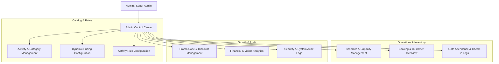

# Panbil Nature Reserve — Admin Management Flow Specification

## 1. Admin System Architecture & Access Control

The Admin Dashboard provides management capabilities for Panbil Nature Reserve operations. Access is restricted to users with `ADMIN` or `SUPER_ADMIN` roles enforced via Supabase JWT claims and RLS policies.

---

## 2. Admin Operational Workflows

### 2.1 Activity & Category Management
- **Category Operations**: Admin can add, reorder, or update activity categories (e.g. `Adventure`, `Educational`, `Nature Trail`).
- **Activity Creation & Media Gallery**:
  - Set activity `name`, `slug`, `description`, `duration_minutes`, `status` (`ACTIVE`, `INACTIVE`, `MAINTENANCE`).
  - Toggle `requires_timeslot` (`TRUE` for ATV/Paintball, `FALSE` for Edu Park day passes).
  - Upload & manage image gallery in Supabase Storage with display orders.

### 2.2 Dynamic Pricing Configuration
- Admin sets up pricing tiers in `activity_pricing`:
  - **Standard Pricing** (e.g. Edu Park WNI Adult Rp 50.000)
  - **Weekend / Holiday Surcharge** (e.g. ATV Weekend Rate Rp 150.000)
  - **Flat Group Pricing** (e.g. Paintball 4-Person Package Rp 400.000)
- Pricing records store effective validity ranges (`valid_from`, `valid_to`).

### 2.3 Schedule & Capacity Generator Workflow
For slot-based activities (ATV, Paintball, Hiking):
1. **Batch Slot Generator**: Admin specifies date range (e.g. `2026-09-01` to `2026-09-30`), start time, end time, slot interval (e.g. 60 mins), and slot capacity (e.g. 10 ATVs).
2. System auto-populates `activity_schedules` rows.
3. **Manual Capacity Overrides**: Admin can adjust individual slot capacity on specific dates (e.g. reduce ATV capacity to 7 on maintenance days).

### 2.4 Booking & Customer Overrides
- **Search & Filter**: Search by `booking_number`, customer name, date, or activity.
- **Manual Status Updates**: Admin can trigger manual status overrides (e.g., mark cash payment as `PAID`, process manual refund/cancellation).
- **Rescheduling**: Admin can move a booking to a different date/schedule slot subject to capacity verification.

### 2.5 Promo Code Management
- Create promo codes with percentage or fixed discount rules.
- Set minimum purchase thresholds, maximum discount caps, usage limits, and expiration dates.
- Real-time redemption tracking via `promo_redemptions`.

### 2.6 Analytics & Reports
- **Sales & Revenue Report**: Filtered by date range, category, and payment channel.
- **Capacity & Occupancy Rates**: Percentage utilization per activity slot (identifying peak vs off-peak hours).
- **Attendance & Check-in Audit**: Real-time count of visitors checked in at gate locations versus total expected tickets.
