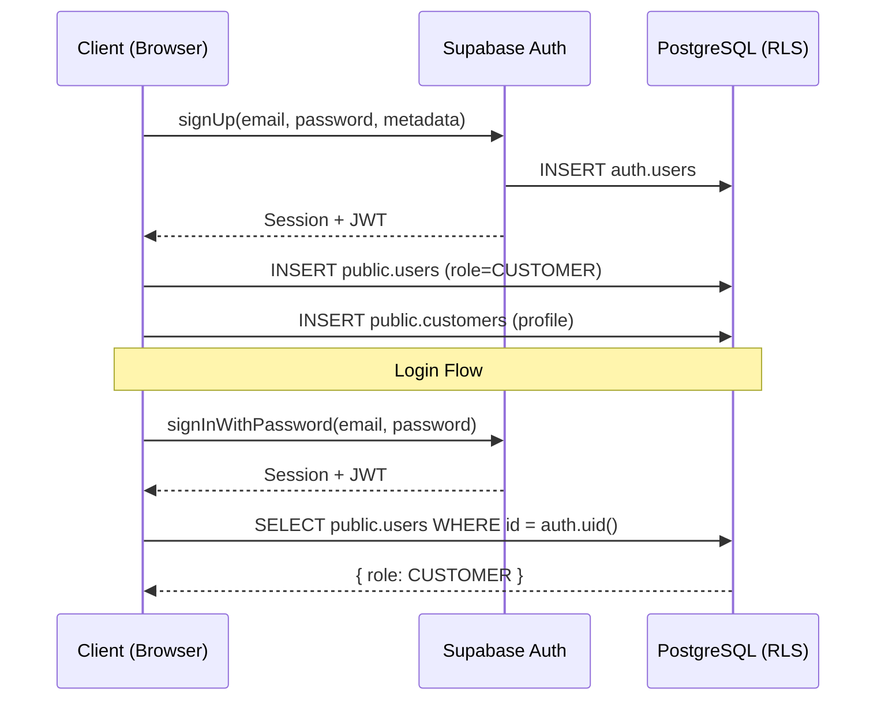

# Panbil Nature Reserve — Authentication & Role Management Guide

## 1. Authentication Architecture

Panbil Nature Reserve uses **Supabase Auth** as the sole authentication provider. No custom password handling or token management is implemented.

### Authentication Flow



### Supported Operations

| Operation | Method | Notes |
| :--- | :--- | :--- |
| Register | `supabase.auth.signUp()` | Creates auth user + public.users + public.customers |
| Login | `supabase.auth.signInWithPassword()` | Returns JWT session |
| Logout | `supabase.auth.signOut()` | Clears session |
| Password Reset | `supabase.auth.resetPasswordForEmail()` | Sends email link |
| Session Refresh | Automatic | `autoRefreshToken: true` in client config |
| Auth State | `supabase.auth.onAuthStateChange()` | Real-time listener |

---

## 2. Role Model

### Available Roles

| Role | Assignment Method | Registration Access |
| :--- | :--- | :--- |
| `CUSTOMER` | Automatic on public registration | Public |
| `STAFF` | Manual by Admin/Super Admin | Admin-only |
| `ADMIN` | Manual by Super Admin | Super Admin-only |
| `SUPER_ADMIN` | Manual by Super Admin / seed | Super Admin-only |

### Role Trust Model

> [!IMPORTANT]
> **Roles are NEVER trusted from the client.**
> The frontend obtains the user's role by querying `public.users.role` via Supabase RLS-protected queries. The client cannot set or modify their own role.

### Role Hierarchy

```
SUPER_ADMIN (highest)
  └── ADMIN
        └── STAFF
              └── CUSTOMER (lowest)
```

---

## 3. Protected Routes

### Public Routes (No Authentication Required)

| Route | Page |
| :--- | :--- |
| `/` | Landing Page |
| `/activities` | Activities Catalog |
| `/activities/:slug` | Activity Detail |
| `/login` | Login |
| `/register` | Customer Registration |
| `/forgot-password` | Password Reset |

### Customer Routes (`CUSTOMER` role required)

| Route | Page |
| :--- | :--- |
| `/dashboard` | Customer Dashboard |
| `/dashboard/profile` | Profile View |
| `/dashboard/bookings` | Booking History |
| `/dashboard/tickets` | E-Tickets |

### Staff Routes (`STAFF`, `ADMIN`, `SUPER_ADMIN` roles)

| Route | Page |
| :--- | :--- |
| `/staff` | Staff Dashboard |
| `/staff/check-in` | Gate Check-in Scanner |

### Admin Routes (`ADMIN`, `SUPER_ADMIN` roles)

| Route | Page |
| :--- | :--- |
| `/admin` | Admin Dashboard |
| `/admin/bookings` | Booking Management |
| `/admin/activities` | Activity Management |
| `/admin/schedules` | Schedule Management |
| `/admin/pricing` | Pricing Management |
| `/admin/customers` | Customer Management |
| `/admin/payments` | Payment Management |
| `/admin/promos` | Promo Code Management |
| `/admin/reports` | Reports & Analytics |

### Super Admin Routes (`SUPER_ADMIN` only)

| Route | Page |
| :--- | :--- |
| `/admin/users` | User Management |
| `/admin/settings` | System Settings |

### Route Guard Behavior

| Scenario | Behavior |
| :--- | :--- |
| Unauthenticated → Protected route | Redirect to `/login` |
| Customer → `/admin` | Redirect to `/dashboard` |
| Customer → `/staff` | Redirect to `/dashboard` |
| Staff → `/admin/settings` | Redirect to `/staff` |
| Authenticated → `/login` | Redirect to role-specific dashboard |

---

## 4. Session Handling

### Session Lifecycle

1. **Creation**: Session is created on successful `signInWithPassword()` or `signUp()`.
2. **Persistence**: Supabase client persists the session in `localStorage` automatically (`persistSession: true`).
3. **Auto Refresh**: JWT tokens are automatically refreshed before expiration (`autoRefreshToken: true`).
4. **State Listener**: `onAuthStateChange()` listens for `SIGNED_IN`, `SIGNED_OUT`, `TOKEN_REFRESHED` events.
5. **Termination**: `signOut()` clears local session and invalidates the refresh token.

### Auth Context State Machine

```
┌─────────────┐
│   loading    │ ← Initial state (checking session)
└─────┬───────┘
      │
      ├── Session found ──→ ┌──────────────┐
      │                     │ authenticated │
      │                     └──────────────┘
      │
      └── No session ────→ ┌────────────────┐
                           │ unauthenticated │
                           └────────────────┘
```

---

## 5. Profile Creation

### Registration Flow

1. `supabase.auth.signUp()` creates a new entry in `auth.users`.
2. Client inserts a row into `public.users` with `role = 'CUSTOMER'` using `UPSERT` (idempotent).
3. Client inserts a row into `public.customers` with profile details using `UPSERT` (idempotent).
4. The `UPSERT` approach prevents duplicate profiles on retry or page refresh during registration.

### Idempotency Guarantee

The `UPSERT ... ON CONFLICT (id/user_id)` pattern ensures:
- Retrying registration does NOT create duplicate users or customer profiles.
- Session refresh does NOT trigger duplicate profile creation.
- The `CUSTOMER` role is always assigned server-side and cannot be overridden by client.

---

## 6. Security Assumptions

> [!CAUTION]
> The following security invariants must hold at all times:

1. **`SUPABASE_SERVICE_ROLE_KEY` is NEVER included in frontend bundles.** Only `VITE_SUPABASE_URL` and `VITE_SUPABASE_ANON_KEY` are used in client code.
2. **Frontend route guards are defense-in-depth.** The true authorization boundary is Supabase RLS on the PostgreSQL database.
3. **Roles are read from `public.users.role`**, not from client-provided values or JWT claims alone.
4. **Passwords are handled exclusively by Supabase Auth.** No manual password hashing, storage, or comparison is implemented.
5. **Auth tokens are managed by Supabase client library.** No manual `localStorage` token management.
6. **Error messages do not leak account existence.** Generic error messages are shown for invalid login attempts.
7. **`.env` files containing secrets are gitignored.** Only `.env.example` with safe placeholders is committed.

---

## 7. Validation Rules

### Registration Form

| Field | Validation |
| :--- | :--- |
| Full Name | Required, 2-100 characters |
| Email | Required, valid email format |
| Phone | Required, 10-15 digits, numeric only |
| Password | Required, min 8 chars, must contain uppercase + lowercase + digit |
| Confirm Password | Must match password |

### Login Form

| Field | Validation |
| :--- | :--- |
| Email | Required, valid email format |
| Password | Required |

---

## 8. Error Handling

All Supabase Auth errors are translated to user-friendly Indonesian messages:

| Error Condition | User Message |
| :--- | :--- |
| Invalid credentials | Email atau password salah. |
| Email not confirmed | Email belum dikonfirmasi. Silakan cek inbox Anda. |
| User already registered | Email sudah terdaftar. Silakan gunakan email lain atau login. |
| Rate limit exceeded | Terlalu banyak percobaan. Silakan tunggu beberapa saat. |
| Generic error | Terjadi kesalahan. Silakan coba lagi. |
