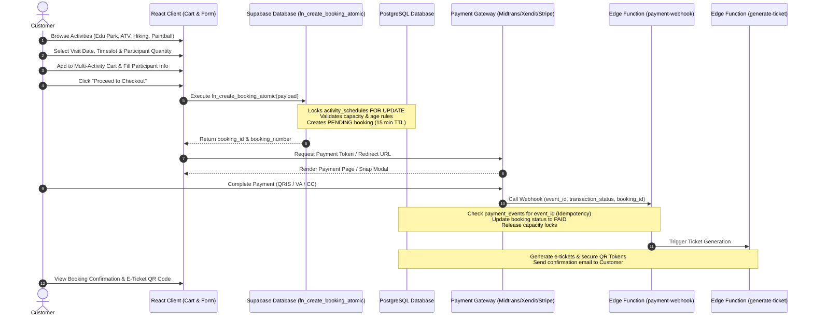
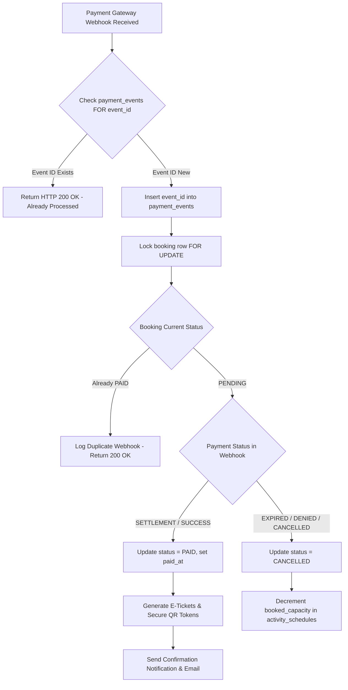

# Panbil Nature Reserve — Booking & Payment Flow Specification

## 1. End-to-End Customer Booking Journey Diagram



---

## 2. Detailed Booking Flow Specifications

### 2.1 Activity Selection & Dynamic Rule Validation
1. **Activity Exploration**: Customer views catalog filtered by category (`Edu Park`, `Eco Park`, `Hiking`, `Paintball`, `ATV`).
2. **Date & Timeslot Selector**:
   - For `requires_timeslot = TRUE` (ATV, Paintball, Hiking): Customer picks date and available start/end timeslot. Live capacity indicator fetched from `activity_schedules`.
   - For `requires_timeslot = FALSE` (Edu Park, Eco Park): Customer picks date (Day Pass).
3. **Dynamic Rule Enforcement**:
   - If activity is **ATV**, frontend evaluates `activity_rules` (`AGE_RESTRICTION min_age: 17`) and requires driver declaration.
   - If activity is **Hiking**, frontend dynamically requires emergency contact fields (`emergency_contact_name`, `emergency_contact_phone`).
   - If activity is **Paintball**, frontend validates `min_participants >= 4`.

### 2.2 Multi-Activity Cart Aggregation
A customer can combine different activities into a single shopping cart:
```json
{
  "customer_id": "c1a2b3c4-...",
  "items": [
    {
      "activity_id": "act-edu-park-uuid",
      "schedule_id": "sch-20260825-edupark-uuid",
      "quantity": 3,
      "participants": [
        {"full_name": "Budi Santoso", "age": 35},
        {"full_name": "Sinta Santoso", "age": 32},
        {"full_name": "Andi Santoso", "age": 8}
      ]
    },
    {
      "activity_id": "act-atv-uuid",
      "schedule_id": "sch-20260825-1000-atv-uuid",
      "quantity": 2,
      "participants": [
        {"full_name": "Budi Santoso", "age": 35, "identity_number": "217101..."},
        {"full_name": "Sinta Santoso", "age": 32, "identity_number": "217102..."}
      ]
    }
  ]
}
```

### 2.3 Checkout & Atomic Booking Creation
When customer clicks **Checkout**:
1. Frontend calls `fn_create_booking_atomic` with cart payload.
2. PostgreSQL opens explicit transaction:
   - For each item, executes `SELECT total_capacity, booked_capacity FROM activity_schedules WHERE id = target_schedule_id FOR UPDATE;`.
   - Checks `(booked_capacity + quantity) <= total_capacity`.
   - If valid: Increments `booked_capacity += quantity`, creates `bookings` row with `status = 'PENDING'` and `expires_at = NOW() + INTERVAL '15 minutes'`.
   - Creates corresponding `booking_items` and `booking_participants` records.
   - Inserts snapshot pricing in `booking_items` to protect against future price changes.
3. Returns `booking_id` and payment token.

### 2.4 Idempotent Payment Webhook Processing



Key Idempotency Principles:
- Every payment gateway webhook includes a unique `event_id` or `idempotency_key`.
- The database enforces a `UNIQUE` constraint on `payment_events.event_id`.
- Duplicate webhook notifications return `200 OK` instantly without re-processing payments or duplicating ticket creation.

### 2.5 Ticket & Secure QR Generation
Once payment status transitions to `PAID`:
1. System creates 1 `tickets` record for each participant per `booking_item`.
2. Each ticket generates a record in `qr_codes` containing an unguessable 256-bit cryptographic token (`qr_token`).
3. **Security Rule**: The QR payload string strictly contains:
   `https://panbilnaturereserve.id/checkin/v1?t=c9a71b4e82f34910a5b28d61f90e3d1c`
   (Zero PII, zero NIK, zero password, zero customer phone numbers exposed).
