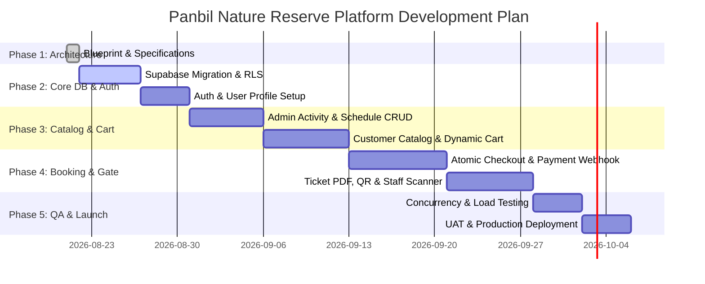

# Panbil Nature Reserve — Development Roadmap, Testing & SEO Blueprint

## 1. Phased Development Roadmap



---

## 2. Sprint Execution Plan

### Phase 2: Database Infrastructure & Auth Setup
- Deploy PostgreSQL migrations (`tables`, `indexes`, `triggers`).
- Enable Row-Level Security (RLS) policies on all tables.
- Configure Supabase Auth with custom JWT claims for roles (`SUPER_ADMIN`, `ADMIN`, `STAFF`, `CUSTOMER`).

### Phase 3: Catalog & Dynamic Cart Engine
- Develop Admin UI for Activity, Category, Pricing, Rule, and Schedule management.
- Develop Customer Activity Catalog (`/activities`, `/activities/atv`, `/activities/hiking`, etc.).
- Build dynamic multi-activity Shopping Cart supporting participant assignment.

### Phase 4: Atomic Checkout, Payment & Ticketing Engine
- Implement PostgreSQL RPC `fn_create_booking_atomic` with `SELECT FOR UPDATE` capacity locks.
- Build Payment Gateway integration and Edge Function for idempotent webhook handling (`payment_events`).
- Build PDF E-Ticket & Secure QR Token generator Edge Function.
- Build Staff Mobile Web Scanner app with atomic check-in validation `fn_perform_staff_checkin`.

### Phase 5: Testing, Hardening & Production Launch
- Execute full testing suite (Unit, Integration, E2E, Load testing).
- Perform security audit & RLS verification.
- Deploy to Vercel production domain with SSL & DNS configuration.

---

## 3. QA & Testing Strategy

### 3.1 Unit & Integration Testing (Vitest & React Testing Library)
- Validate dynamic cart calculations, multi-activity subtotal sums, and promo code discounts.
- Validate dynamic rule parsing (e.g. verifying Zod schema builder enforces age restriction for ATV).

### 3.2 Concurrency & Load Testing (k6 / Artillery)
- **Race Condition Simulation**: Execute 100 concurrent checkout virtual users (VUs) bidding for 10 ATV slots at the exact same millisecond.
- **Verification Criterion**: Database MUST accept exactly 10 bookings and reject 90 with `CAPACITY_EXCEEDED` error without deadlocking or overbooking.

### 3.3 End-to-End Testing (Playwright)
- Automated customer checkout journey from homepage to activity selection, cart aggregation, payment simulation, ticket viewing, and staff QR scanning.

---

## 4. SEO & Metadata Architecture

### 4.1 URL Hierarchy Specifications
- `/` — Homepage (Hero, Featured Activities, Reserve Overview)
- `/activities` — Activity Directory / Search & Filter
- `/activities/edu-park` — Edu Park Detail
- `/activities/eco-park` — Eco Park Detail
- `/activities/hiking` — Hiking Trail Detail
- `/activities/paintball` — Paintball Arena Detail
- `/activities/atv` — ATV Adventure Detail

### 4.2 Dynamic SEO & OpenGraph Integration
Each activity page dynamically injects metadata via React Helmet Async:
```html
<title>ATV Adventure Tour | Panbil Nature Reserve Batam</title>
<meta name="description" content="Book your ATV adventure at Panbil Nature Reserve, Batam. Experience thrilling off-road trails surrounded by pristine nature." />
<meta property="og:title" content="ATV Adventure Tour | Panbil Nature Reserve Batam" />
<meta property="og:description" content="Book your ATV adventure at Panbil Nature Reserve, Batam." />
<meta property="og:image" content="https://panbilnaturereserve.id/assets/og-atv.jpg" />
<meta property="og:type" content="website" />
```

### 4.3 Schema.org JSON-LD Structured Data
Activity pages render JSON-LD for Search Engines:
```json
{
  "@context": "https://schema.org",
  "@type": "TouristAttraction",
  "name": "ATV Adventure - Panbil Nature Reserve",
  "description": "Off-road All-Terrain Vehicle tour inside Batam rainforest.",
  "location": {
    "@type": "Place",
    "name": "Panbil Nature Reserve",
    "address": {
      "@type": "PostalAddress",
      "addressLocality": "Batam",
      "addressCountry": "ID"
    }
  }
}
```
