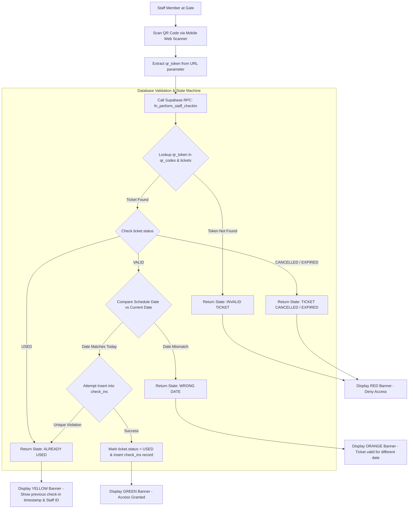

# Panbil Nature Reserve — Staff Gate Check-in Specification

## 1. On-Site Gate Check-in Flow Diagram



---

## 2. Validation State Machine Specifications

| Check-in Status Code | Visual Indicator | Operational Meaning & Trigger Condition | Action Taken |
| :--- | :--- | :--- | :--- |
| `VALID` | **GREEN BANNER** | Ticket is valid, date matches today, time slot is valid, check-in recorded. | Gate opens / Visitor admitted. |
| `ALREADY USED` | **YELLOW BANNER** | Ticket was previously scanned. Shows exact time and gate location of prior scan. | Access denied; guard inspects previous check-in log. |
| `INVALID` | **RED BANNER** | QR token does not exist in database or was forged. | Access denied. |
| `CANCELLED` | **DARK RED** | Booking was refunded or cancelled by customer/admin. | Access denied. |
| `WRONG DATE` | **ORANGE BANNER** | Ticket date is for a future or past date (not today). | Access denied; direct customer to customer service. |
| `EXPIRED` | **GREY BANNER** | Ticket validity period has elapsed without check-in. | Access denied. |

---

## 3. Double Check-In Prevention Logic

To prevent simultaneous or duplicate check-ins at multiple gate scanners:
1. Database enforces a `UNIQUE` constraint on `check_ins.ticket_id`.
2. Check-in execution calls an atomic database stored function `fn_perform_staff_checkin`:
```sql
CREATE OR REPLACE FUNCTION fn_perform_staff_checkin(
    p_qr_token VARCHAR,
    p_staff_id UUID,
    p_gate VARCHAR
) RETURNS JSONB AS $$
DECLARE
    v_ticket_id UUID;
    v_ticket_status VARCHAR;
    v_schedule_date DATE;
    v_current_date DATE := CURRENT_DATE;
BEGIN
    -- 1. Fetch ticket details using lock FOR UPDATE
    SELECT t.id, t.status, s.schedule_date
    INTO v_ticket_id, v_ticket_status, v_schedule_date
    FROM qr_codes q
    JOIN tickets t ON t.id = q.ticket_id
    JOIN booking_items bi ON bi.id = t.booking_item_id
    JOIN activity_schedules s ON s.id = bi.schedule_id
    WHERE q.qr_token = p_qr_token
    FOR UPDATE OF t;

    IF v_ticket_id IS NULL THEN
        RETURN jsonb_build_object('status', 'INVALID', 'message', 'Invalid QR Token');
    END IF;

    IF v_ticket_status = 'USED' THEN
        RETURN jsonb_build_object('status', 'ALREADY_USED', 'message', 'Ticket has already been used');
    ELSIF v_ticket_status != 'VALID' THEN
        RETURN jsonb_build_object('status', v_ticket_status, 'message', 'Ticket is not valid');
    END IF;

    IF v_schedule_date != v_current_date THEN
        RETURN jsonb_build_object('status', 'WRONG_DATE', 'message', 'Ticket valid for ' || v_schedule_date);
    END IF;

    -- 2. Mark ticket as USED and insert check-in record
    UPDATE tickets SET status = 'USED' WHERE id = v_ticket_id;
    INSERT INTO check_ins (ticket_id, scanned_by, gate_location)
    VALUES (v_ticket_id, p_staff_id, p_gate);

    RETURN jsonb_build_object('status', 'VALID', 'message', 'Check-in Successful');
EXCEPTION
    WHEN unique_violation THEN
        RETURN jsonb_build_object('status', 'ALREADY_USED', 'message', 'Ticket was just scanned at another gate');
END;
$$ LANGUAGE plpgsql SECURITY DEFINER;
```

---

## 4. Manual Fallback Operations
When a customer's phone battery dies or the camera fails to scan a damaged screen:
1. Staff can switch to **Manual Code Lookup** in the Staff Scanner app.
2. Staff enters `ticket_number` (e.g. `TKT-ATV-20260821-008`) or customer phone number.
3. System verifies staff authorization, prompts for participant identity verification, and executes `fn_perform_staff_checkin`.
